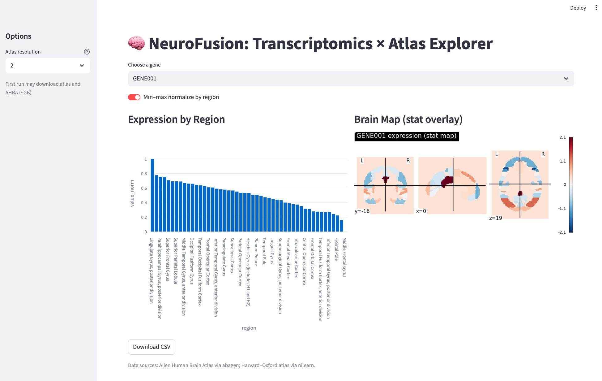

# NeuroFusion

Interactive dashboard that fuses **brain transcriptomics** (Allen Human Brain Atlas, AHBA) with **neuroimaging atlases** (e.g., Harvard–Oxford in MNI space) for region-wise exploration.

## Features (MVP)
- Gene selector with region-wise expression overlay
- Brain map preview (nilearn) and bar chart by region
- Downloadable CSV summaries

---

## 📂 Project Structure

NeuroFusion/
├── README.md                # Project description and instructions
├── LICENSE                  # MIT license
├── requirements.txt         # Python dependencies
├── app/
│   ├── init.py
│   ├── dashboard.py         # Streamlit dashboard entry
│   ├── data_loader.py       # Atlas + AHBA data handling
│   └── utils.py             # Helper functions (normalization, plotting)
│
├── data/                    # Data storage (ignored in .git)
│   ├── atlas/               # Atlas NIfTI files
│   └── expression/          # Preprocessed AHBA expression tables
│
├── scripts/
│   ├── fetch_atlas.py       # Download atlas files
│   └── prep_ahba_regions.py # Build AHBA → region table
│
├── figures/                 # Screenshots or figures for docs
├── notebooks/               # (Optional) exploration notebooks
└── .github/workflows/       # CI/CD configs (optional)

---

## 🖼️ Demo Screenshot



> 📎 This screenshot shows the **NeuroFusion dashboard** in action.  
> On the left, the sidebar allows selection of the **atlas resolution**, **gene of interest**, and optional **normalization**.  
> The center-left panel displays a **bar chart** of expression levels for the selected gene across all brain regions.  
> The center-right panel shows a **statistical brain map overlay** highlighting spatial expression patterns on the selected atlas.  
> A **download button** below allows exporting the region-wise expression table as CSV.

---

## Quickstart
```bash
# 1) Create env and install
python -m venv .venv && source .venv/bin/activate
pip install -r requirements.txt

# 2) Fetch atlas + prep expression (cached under data/)
## Prefetch atlas
python scripts/fetch_atlas.py --resolution 2
## Build AHBA → region table
python scripts/prep_ahba_regions.py --atlas harvard_oxford --resolution 2

# 3) Run dashboard
streamlit run app/dashboard.py
```

## Data notes
- AHBA processing uses [`abagen`](https://abagen.readthedocs.io/). First run downloads ~GBs and caches on disk.
- Harvard–Oxford atlas is fetched via `nilearn.datasets`.

## Repo layout
See comments in each file; `app/data_loader.py` centralizes data I/O.

## License
MIT (see `LICENSE`). Cite the Allen Institute + atlas authors when publishing.
